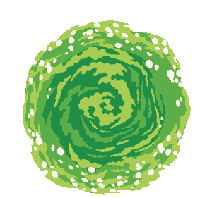

<!-- Sprogstatistik + GIFs tæt side om side, uden border -->

  <!-- Venstre: sprogkort -->
  

  <!-- Højre: portal + Rick -->
  

    
    
  

 

<!-- LinkedIn -->
<h3 align="left">Links:</h3>

  

